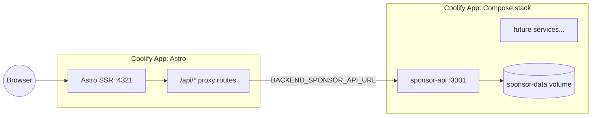

# SBR27 architecture recommendation

Summary of the architecture decision from planning the 2027 rebuild.

## Recommendation

**Start a fresh `SBR27` repo as a small monorepo** for the event platform:

- Astro SSR frontend (Bun runtime, `@astrojs/node` standalone)
- Backend mini-services in `services/` orchestrated by Docker Compose
- Two Coolify applications on the VPS (frontend + backend stack)

Split a backend into its **own repo** only when it outlives the event site or needs independent versioning/team ownership.

## Why not extend SBR-AstroPage?

The current repo accumulated:

- Nested `AstroPage/` submodule duplication
- Recovery worktrees and branch experiments (`impeccable-audit`)
- Legacy 2026 archive concerns mixed with forward-looking 2027 work
- Removed services (SwapCard, Ticket Tailor, render-service) leaving dead paths

A clean repo avoids carrying that baggage into `synbioreactor.de`.

## Domain layout

| Domain | Repo | Purpose |
|--------|------|---------|
| `synbioreactor.de` | SBR27 | Live 2027 summit |
| `2026.synbioreactor.de` | SBR-AstroPage | Read-only 2026 archive |

## Coolify topology



### Frontend app

- Build pack: **Dockerfile** (root)
- Port: **4321**
- Health: **`/api/health`**
- Build arg: `SITE_URL=https://synbioreactor.de`

### Backend app

- Build pack: **Docker Compose**
- Compose file: `services/docker-compose.yml`
- Public service: `sponsor-api`
- Health: **`/health`** on port 3001

Coolify's reverse proxy handles TLS and domains. Do not add a separate nginx container unless you have a specific need.

## Connector pattern (frontend → backend)

1. Register each backend in `src/lib/backend/config.ts` with an env var (`BACKEND_SPONSOR_API_URL`).
2. Use `src/lib/backend/server-fetch.ts` for server-side proxy calls from Astro API routes.
3. Expose **same-origin** routes under `src/pages/api/` so the browser never needs CORS or secret backend URLs.
4. `/api/health` aggregates frontend + backend status for deploy verification.

## Adding a new backend service

1. Add `services/my-service/` with its own Dockerfile.
2. Register the service in `services/docker-compose.yml` (volume, healthcheck, env).
3. Add an entry to `backendServices` in `config.ts`.
4. Add Astro proxy routes under `src/pages/api/my-service/`.
5. Document the new env var in `deploy/coolify/README.md`.

## Local development

```fish
# Frontend
cd SBR27
cp .env.example .env
bun install
bun run dev

# Backend stack (separate terminal)
docker compose --env-file services/.env.example -f services/docker-compose.yml up --build
```

Point `BACKEND_SPONSOR_API_URL=http://localhost:3001` in frontend `.env` for local proxy testing.

## Stack defaults

| Layer | Choice |
|-------|--------|
| Runtime | Bun |
| Framework | Astro 6, `output: 'server'` |
| Styling | Tailwind CSS v4 |
| UI | shadcn/ui patterns, Radix primitives |
| Motion | Framer Motion |
| Backend services | Bun + Express (sponsor-api) |
| Deploy | Coolify on VPS, Docker Compose for backends |

## What stays in the 2026 archive repo

- Legacy recap homepage components
- Static speakers/partners/timetable pages
- Newsletter-only API (Mautic)
- No registration, tickets, sponsoring UI, or SwapCard

SBR27 rebuilds the **pre-event funnel** (tickets, sponsoring, pitch, live integrations) on the patterns in `uHaul/`, not by reverting the archive.
